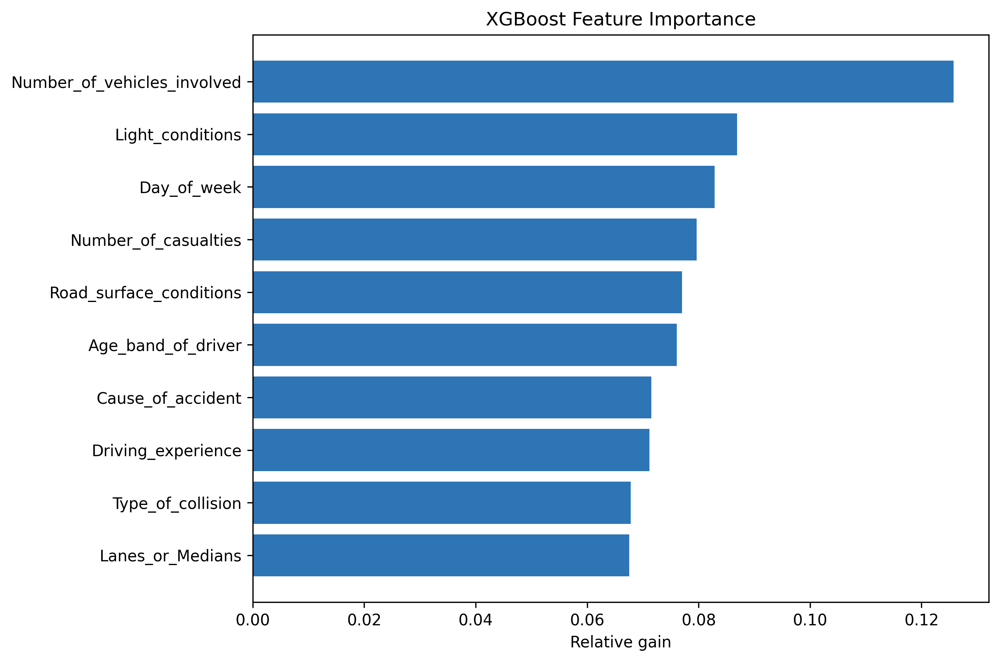

# Road Accident Severity Prediction and Dashboard

This is an academic Data Science project. I used exploratory data analysis, a Power BI dashboard, and machine-learning experiments to study factors related to road accident severity. The project looks at road conditions, vehicle types, driver characteristics, and casualty information.

## Project Highlights

- Cleaned and explored more than 12,000 road accident records.
- Built an interactive Power BI dashboard to explore accident-severity patterns.
- Compared Decision Tree, XGBoost, and Random Forest with different resampling methods. The cross-validation and held-out test results are in `reports/model_results.csv`.
- Received First Runner-Up at the 12th National Conference on Science and Technology, Phranakhon Si Ayutthaya Rajabhat University.

## Project Layout

- `notebooks/notebook.ipynb` - Primary record of exploratory analysis and model experiments.
- `src/data_processing.py` - Loads, cleans, and exports the dataset.
- `src/feature_engineering.py` - Encodes categorical variables and prepares analysis fields.
- `src/visualization.py` - Creates correlation and dashboard-supporting visualizations.
- `src/model_training.py` and `src/models/` - Defines and evaluates the machine learning models.
- `tests/` - Automated tests for preprocessing and feature engineering.
- `reports/model_results.csv` - Cross-validation and held-out test results from the reproducible baseline.
- `reports/xgboost_feature_importance.csv` - Gain-based importance scores from the selected XGBoost model.

## Setup

```bash
python -m venv .venv
source .venv/bin/activate
pip install -r requirements.txt
jupyter notebook notebooks/notebook.ipynb
```

## Data

Place the original dataset at `data/raw/RTA Dataset.csv`.

The project uses the [Road Accidents Severity Prediction Kaggle notebook](https://www.kaggle.com/code/kanuriviveknag/road-accidents-severity-prediction) as its dataset reference. The raw and processed data directories are ignored by Git because the dataset may be subject to redistribution restrictions.

## Workflow

1. Clean the dataset by removing selected columns with extensive missing data and dropping remaining incomplete rows.
2. Prepare categorical features for analysis and modeling.
3. Explore accident-severity patterns and relationships between relevant variables.
4. Compare Decision Tree, XGBoost, and Random Forest models with different resampling methods.
5. Present findings through an interactive dashboard for clear and accessible analysis.

## Model Evaluation

The model experiments use a stratified 80:20 train-test split and evaluate Decision Tree, XGBoost, and Random Forest classifiers. Random Under-Sampling, Random Over-Sampling, and SMOTE are used to address class imbalance.

In the current reproducible baseline run, XGBoost without resampling had the highest mean weighted F1-score in 10-fold cross-validation. It was selected because weighted F1-score reflects overall performance while considering class imbalance. Its mean accuracy was 84.39%, its mean weighted F1-score was 80.09%, and its mean macro F1-score was 40.00%. The full comparison is in `reports/model_results.csv`.

This choice is also consistent with Muktar and Fono (2024), who compared XGBoost, CatBoost, Random Forest, and Gradient Boosting for traffic-accident severity prediction and reported XGBoost as their best-performing model. The datasets and evaluation settings are different, so this study is used as supporting context; the final choice for this project is based on this project's own cross-validation results.

The modeling work is an academic experiment and is not presented as a deployed prediction system.

## From analysis to dashboard

The project connects analysis and communication in three steps. First, EDA finds patterns in road, vehicle, driver, and accident conditions. Second, the model comparison checks whether the variables have useful predictive signal. The selected XGBoost model is then used to calculate gain-based feature importance. Finally, the Power BI dashboard presents the key findings in a format that is easier to explore.

Feature importance is the main basis for choosing the dashboard's key analysis variables. For example, the number of vehicles involved, light conditions, day of week, and number of casualties are included because they are important to the model's predictions. Other variables, such as vehicle type, driver gender, and cause of accident, are also included to provide more context and help users explore the data more fully. Feature importance supports interpretation of the model; it does not prove that a variable causes accident severity.

In this baseline, the most important variables were the number of vehicles involved (12.58% relative gain), light conditions (8.69%), and day of week (8.28%). The complete ranking is available in `reports/xgboost_feature_importance.csv`.



Methodology details are available in [`docs/modeling-methodology.md`](docs/modeling-methodology.md).

## Live Dashboard

Explore the interactive Power BI dashboard here: [Road Accident Severity Dashboard](https://app.powerbi.com/view?r=eyJrIjoiMDRiOWEwNGUtYmNiNC00NzUzLWFkOWYtZDAxOTMzOTkwNjQ5IiwidCI6ImNmODFmMWRmLWRlNTktNGMyOS05MWRhLWEyZGZkMDRhYTc1MSIsImMiOjEwfQ%3D%3D).

The dashboard supports interactive exploration of accident-severity patterns, road conditions, vehicle types, driver characteristics, and casualty information.

If you prefer a quick static preview, you can also view or download the [dashboard PDF](reports/dashboard/Dashboard_Accident_Insight.pdf). The PDF is included as a non-interactive backup of the dashboard.

## Reference

Muktar, B., & Fono, V. (2024). *Toward Safer Roads: Predicting the Severity of Traffic Accidents in Montreal Using Machine Learning*. Electronics, 13(15), 3036. https://doi.org/10.3390/electronics13153036

## License

The project code uses the MIT License. The road-accident dataset is not included in Git because it may have separate redistribution terms. Please check the dataset source and its terms before using it.
